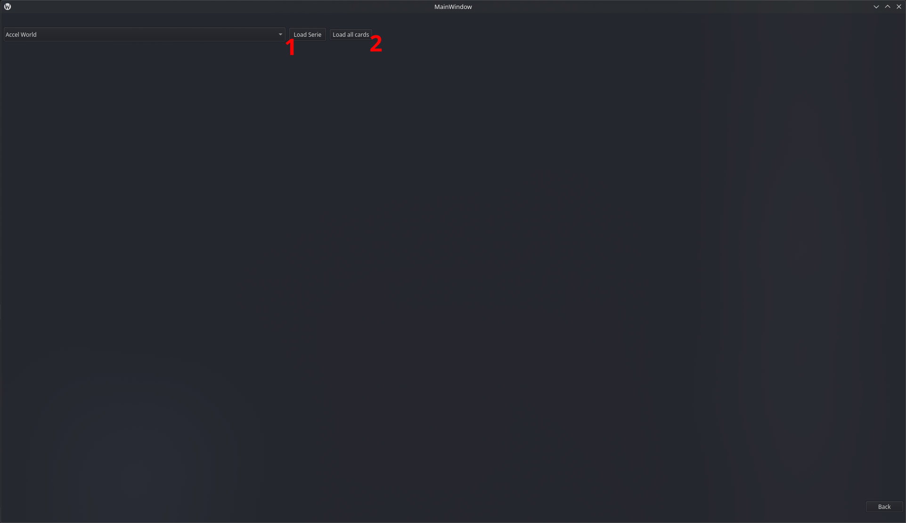
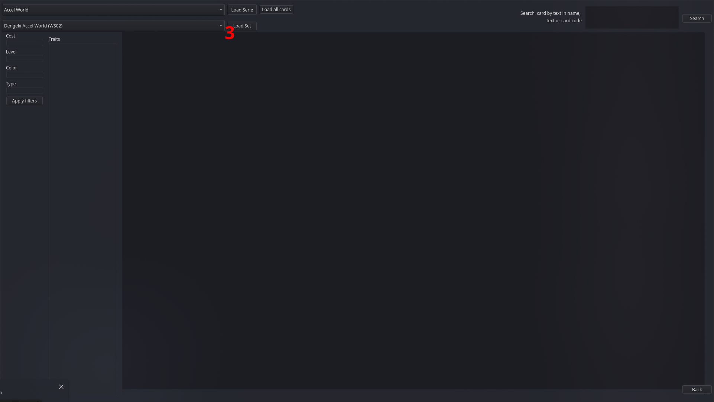
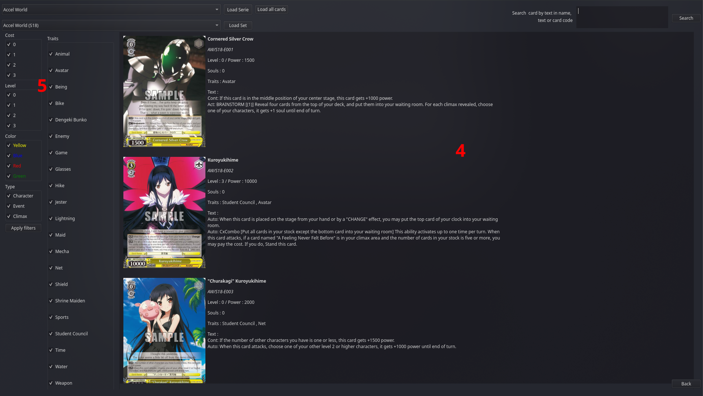
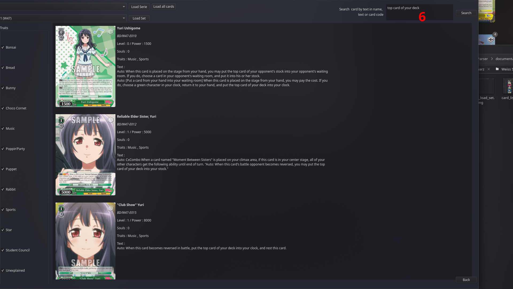

This project has been developed for people using the Weiss Schwarz Simulator.

It is currently only available for linux !

# Installation 

Download the binary from the release folder or build it using the CMake List file 

# Usage

After starting the binary, you will be asked to provide a path to the simulator 

You should enter the path to the "Weiss Schwarz 0.X.X.X Linux_Data" folder of the simulator. 

! You only need to do it once, or when you change the simulator version or path !

When this is done, you will reach the main menu 

## Card list exploration tool 

You can enter this mode using the "Card List Visualization" button. 

From there, you will see a dropdown with all of the series found in the simulator. Pick the one you want, and then you can :

- (1) Load serie : load all the set available , in order to pick one 
- (2) Load all cards : load all the cards so you can look at all cards at once

If you choose Load Serie , you will see a dropdown with all available sets. 

Pick one and click on (3) "Load Set"

From there, you will see all cards in the set or the serie (4). 

On the left you can filter out some of the cards via (5) : 

- cost
- level
- color
- type 
- traits 

If you are looking for a card by name, card code, or text in its effect, you can use the search box at the top right, then click on search
(this features overrides all other filters)

## Default / User deck exploration

This mode allows you to look at the decks you created, or available by default, it is reached from the main menu by "Simulator Deck Editor"

When entered, the tool will load all your decks in a dropdown, so you can pick one.

When picking a deck, it will load the cards in memory (expect 3 or 4 seconds delay), and display the deck.

When sliding your mouse over a card, you will see the card data on the right panel.

## Encore decks import

You can import a deck from encore decks, into the simulator 

Before the first ever import , a backup of your fresh decks file is done into the simulator folder 

Before any import, another backup is done 

After opening the import panel, just paste the deck url into the text edit, and press Import.

The import is done in background, and the panel will close automatically when done (or failed).

The link should look like this : " https://www.encoredecks.com/deck/PPyvcLuvt "

PS : during import, if a card is not is not found by the tool, it will search for the equivalent card (JP or EN, Foil or non foil). All imports should be okay . If you meet an error with import, please open an issue, saying that this deck cannot import, with the link of the deck

# Planned features

Soon : 

 - integration of deck import from encoredecks to the simulator (done , in test)
 - integration of effects icons into cards text and description 
 - support for windows
 - UI updates (alignemnts, better design, responsiveness ?)

Longer : 

 - mac support ?

# Questions

- I have updated or changed my simulator path, how can I change it in the software ? 

=> You can unload the simulator from the main menu, with the "Unload Simulator" button at the bottom left. 
You will be able to enter the new path and save it again

- I have a bug, what can I do ? 

=> You can post an issue in this github repository, explaining the bug, and if possible how you reached the bug, a screenshot and/or a video

